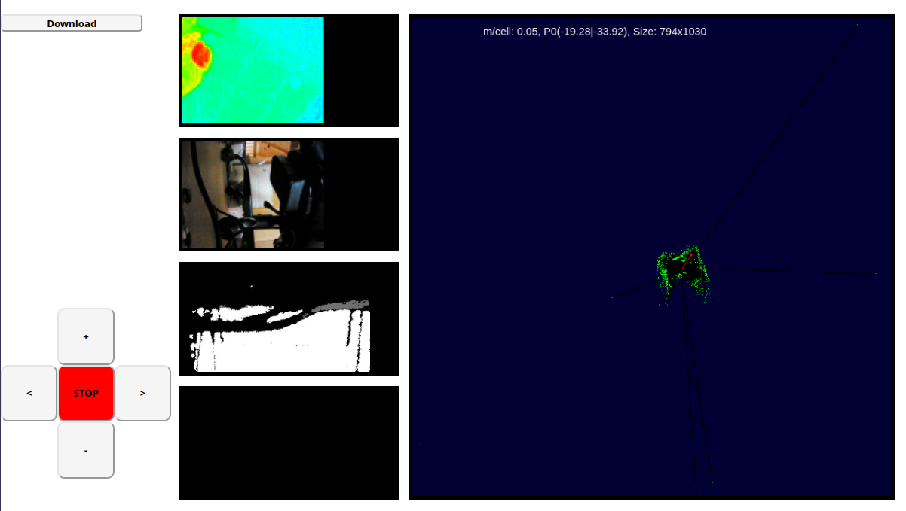

<a href="https://107-systems.org/"></a>
:floppy_disk: `l3xz-mapping`
============================
This repository includes the ROS-based explorative mapping stack of L3X-Z for Elrob 2022.

The stack consists of two parts tested under ROS1 Noetic Ninjemys. Part one runs on a base station, does the mapping using RTAB-Map, data logging and comes with a browser frontend. Part two can be deployed to the Raspberry Pi on the robot. It's purpose is to read all the sensor data and transmit it to part one. 

# Overview
```
.
├── client (client part => deploy this on Your robot)
│   └── client_ws (catkin workspace)
│       └── src
│           ├── l3xz_mapping
│           │   └── launch
│           ├── l3xz_openmv_camera (Driver for OpenMV cameras: https://github.com/107-systems/l3xz_openmv_camera)
│           └── l3xz_sweep_scanner (Driver for Scanse Sweep 360° 2D LIDAR: https://github.com/107-systems/l3xz_sweep_scanner)
├── doc
│   └── img
└── host (host part => deploy this on Your base station)
    └── host_ws (catkin_workspace)
        └── src
            ├── l3xz_mapping (mapping core)
            │   ├── launch
            │   ├── msg
            │   ├── scripts
            │   └── srv
            ├── l3xz_openmv_camera
            └── webgui (webinterface for operation and debugging)
                ├── javascript
                └── resources
```              

# Setup

## Part 1 (the base station part)
Clone the repository and go to host root:
~~~bash
git@github.com:107-systems/l3xz-mapping.git
cd l3xz-mapping/host
git submodule update --init
~~~
Build the docker container:
~~~bash
sudo ./build_docker.sh
~~~
Edit the following files according to Your setup:
* master_ip.conf: IP of base station
* client_ip.conf: IP of robot
* logdrive.conf: Root path of logging directory

Start the docker container:
~~~bash
sudo ./start_docker.sh
~~~
A tmux session will appear, the software base is automatically built and executed.

## Part 2 (the robot part)
Install the Realsense ROS enviroment and chrony for timesync:
~~~bash
sudo apt-get install ros-noetic-realsense2-camera chrony
~~~
Clone the repository and go to client root:
~~~bash
git@github.com:107-systems/l3xz-mapping.git
cd l3xz-mapping/client
git submodule update --init
~~~
Edit the following files according to Your setup:
* master_ip.conf: IP of base station
* client_ip.conf: IP of robot
To establish a connection to the base station with the ROS master, edit the base station IP-Address in ```master_ip.conf```.
Finally, we can start the robot part:
~~~bash
./start.sh
~~~
A tmux session will appear. After the software is built automatically, the sensor nodes will be started.

## Start mapping
After both parts are online, the mapping can be started on the base station:
~~~bash
roslaunch l3xz_mapping l3xz_mapping.launch
roslaunch odom_recorder.launch
roslaunch thermal_recorder.launch
roslaunch plotter_grid.launch
~~~
The data can be viewed via rviz or the dashboard at ```http://localhost:8000```. The robot/ software can also be operated via the dashboard (TBD).


## Nodes

### transform_odom

Creates an odometry message from tf data.

#### Published Topics
| Default Name | Type |
|:-:|:-:|
| `/odom_slam` | [`nav_msgs/Odometry`](https://docs.ros.org/en/noetic/api/nav_msgs/html/msg/Odometry.html) |

#### Parameters
| Name | Default | Description |
|:-:|:-:|-|
| `odometry_out` | `/odom_slam` | Odometry topic name |
| `parent_frame` | `/map` | Parent frame of interesting tf tree part |
| `child_frame` | `/base_link` | Child frame of interesting tf tree part |

### plotter

Plots robot track and OPIs according to Elrob rules into a map. The input map can be an image or data from a topic of type `nav_msgs/OccupancyGrid`. The OPIs to be plotted and the robot track are subscribed from a topic of type `l3xz_mapping/Track`.

#### Parameters
| Name | Default | Description |
|:-:|:-:|-|
| `from_grid` | `false` | Get map topic from OccupancyGrid |
| `img_src` | `/home/log/map.png` | Map image name |
| `img_dest` | `/home/log/map_dest.png` | Destination map image name |
| `meters_per_pixel` | 0.1 | Resolution of map image |
| `bearing_deg` | 0.0 | Robot initial bearing |
| `zero_px` | [100, 100] | Robot initial position |
| `robot_track` | `/l3xz/odom_recorder/track` | Track topic |
| `opi_tracks` | [`/l3xz/thermal_recorder/track`, `/l3xz/radiation_recorder/track`] | OPI topics |
| `grid_topic` | `/grid` | Grid map |

### recorder

Records waypoints according to Elrob log format with Unix timestamp and WSG84 coordinates with images of the artifacts. Also a track containing all waypoints can be published (e.g. for plotting). All the logs are based on an initial startpoint.

#### Service clients

| Default Name | Purpose |
|:-:|:-:|-|
| `recorder/set_startpoint` | Set initial robot position. Needs to be done only once and is necessary to start recording. |
| `recorder/set_waypoint` | Record a new waypoint. |

#### Published Topipcs
| Default Name | Type |
|:-:|:-:|
| `recorder/track` | [`l3xz_mapping/Track` |

#### Parameters
| Name | Default | Description |
|:-:|:-:|-|
| `logpath` | `/home/l3xz/log.txt` | Path for logfile |
| `artifacts` | [] | List of artifact images |
| `track_publishing_rate` | 1 | Period for publishing track rate |
| `publish_track` | `true` | Enable publishing of track |

